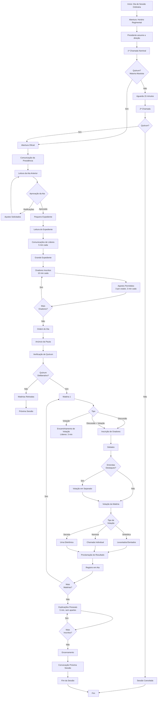
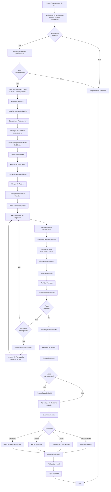
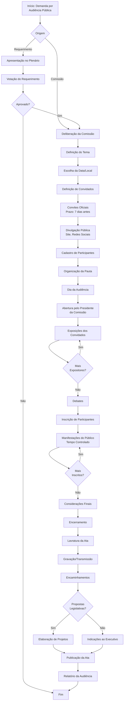
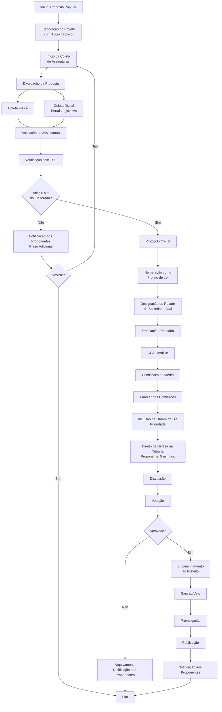

# Fluxogramas dos Processos Legislativos
## Sistema de Gestão Legislativa - CMM

---

## 1. FLUXO DE TRAMITAÇÃO DE PROJETO DE LEI

```mermaid
flowchart TD
    A[Início: Apresentação do Projeto] --> B{Origem}
    B -->|Vereador| C[Protocolo na Diretoria Legislativa]
    B -->|Executivo| C
    B -->|Popular| D[Validação de Assinaturas<br/>5% do eleitorado]
    D --> C
    
    C --> E[Numeração Automática]
    E --> F[Verificação Formal]
    F --> G{Atende<br/>Requisitos?}
    
    G -->|Não| H[Devolução ao Autor]
    G -->|Sim| I[Distribuição à CCJ]
    
    I --> J[Procuradoria Legislativa<br/>Parecer Prévio]
    J --> K[CCJ - Análise Constitucional]
    K --> L{Prazo}
    L -->|Ordinário| M[5 dias úteis]
    L -->|Urgente| N[1 dia útil]
    
    M --> O{Parecer CCJ}
    N --> O
    
    O -->|Inconstitucional| P[Arquivamento]
    P --> Q{Recurso?<br/>1/3 + fundamentação}
    Q -->|Sim| R[Votação no Plenário]
    Q -->|Não| S[Fim: Arquivado]
    
    R --> T{Resultado}
    T -->|Mantém Arquivamento| S
    T -->|Derruba Parecer| U[Continua Tramitação]
    
    O -->|Constitucional| U
    U --> V[Distribuição às Comissões<br/>de Mérito]
    
    V --> W[Comissão de Finanças<br/>se houver impacto orçamentário]
    W --> X[Demais Comissões Temáticas]
    X --> Y[Relatores Designados<br/>Ordem Alfabética]
    
    Y --> Z[Emissão de Pareceres]
    Z --> AA{Admite<br/>Emendas?}
    
    AA -->|Sim| AB[Prazo para Emendas]
    AB --> AC[Análise de Emendas<br/>pelas Comissões]
    AA -->|Não| AD
    
    AC --> AD[Retorno à CCJ<br/>Redação Final]
    AD --> AE[Inclusão na Ordem do Dia]
    
    AE --> AF{Regime}
    AF -->|Ordinário| AG[Aguarda Pauta Normal]
    AF -->|Urgente| AH[Prioridade na Pauta]
    AF -->|Prioridade| AH
    
    AG --> AI[Sessão Plenária]
    AH --> AI
    
    AI --> AJ[1ª Discussão]
    AJ --> AK{Tipo}
    AK -->|Lei Ordinária| AL[Votação Única]
    AK -->|Lei Complementar| AM[2 Turnos]
    AK -->|Emenda LOMAN| AN[2 Turnos + 2/3]
    
    AL --> AO[Votação]
    AM --> AO
    AN --> AO
    
    AO --> AP{Resultado}
    AP -->|Rejeitado| S
    AP -->|Aprovado| AQ[Redação Final pela CCJ]
    
    AQ --> AR[Autógrafos]
    AR --> AS[Encaminhamento ao Prefeito]
    
    AS --> AT[Prefeito: 15 dias]
    AT --> AU{Decisão}
    
    AU -->|Sanção| AV[Lei Sancionada]
    AU -->|Veto Total/Parcial| AW[Retorno à Câmara]
    AU -->|Silêncio| AX[Sanção Tácita]
    
    AW --> AY[Prazo: 30 dias para análise]
    AY --> AZ[Votação do Veto<br/>Maioria Absoluta]
    AZ --> BA{Resultado}
    
    BA -->|Veto Mantido| S
    BA -->|Veto Derrubado| AV
    
    AV --> BB[Promulgação]
    AX --> BB
    BB --> BC[Publicação no e-DOLM]
    BC --> BD[Fim: Lei Vigente]
```

---

## 2. FLUXO DE SESSÃO PLENÁRIA ORDINÁRIA

---

## 3. FLUXO DE ELEIÇÃO DA MESA DIRETORA

```mermaid
flowchart TD
    A[Início: Sessão Preparatória<br/>1º de janeiro] --> B[Vereadores Reunidos<br/>17h]
    B --> C[Direção Provisória]
    C --> D[Presidente Mais Antigo<br/>ou Mais Idoso]
    
    D --> E[Verificação de Quórum<br/>Maioria Absoluta]
    E --> F{Quórum?}
    
    F -->|Não| G[Sessão não Realizada]
    G --> H[Nova Convocação]
    H --> A
    
    F -->|Sim| I[Presidente Provisório<br/>Assume Direção]
    I --> J[Designa 2 Secretários<br/>Partidos Diferentes]
    
    J --> K[Coleta de Diplomas]
    K --> L[Declarações de Bens]
    L --> M[Suspensão dos Trabalhos]
    
    M --> N[Organização Lista<br/>Ordem Alfabética]
    N --> O[Reabertura]
    
    O --> P[Leitura da Lista]
    P --> Q[Proclamação dos Vereadores]
    Q --> R[Análise de Reclamações]
    
    R --> S[Compromisso do<br/>Presidente Provisório]
    S --> T[Posse Individual dos Vereadores<br/>'Assim prometo']
    T --> U[Assinatura do Livro de Posse]
    
    U --> V[ELEIÇÃO DA MESA]
    V --> W[Escolha de 2 Escrutinadores<br/>Partidos Diferentes]
    
    W --> X[ELEIÇÃO DO PRESIDENTE]
    X --> Y[Apresentação de Candidatos<br/>Até início dos trabalhos]
    Y --> Z[Manifestação dos Candidatos<br/>5 min cada]
    
    Z --> AA[Votação Nominal Aberta]
    AA --> AB[Chamada ao Microfone]
    AB --> AC[Vereador Declara Voto]
    
    AC --> AD[Anotação e Checagem]
    AD --> AE{Todos<br/>Votaram?}
    
    AE -->|Não| AB
    AE -->|Sim| AF[Apuração]
    
    AF --> AG{Maioria<br/>Absoluta?}
    AG -->|Não| AH[2º Turno<br/>2 Mais Votados]
    AH --> AI[Nova Votação<br/>Maioria Simples]
    
    AI --> AJ{Empate?}
    AJ -->|Sim| AK[Eleito: Mais Idoso<br/>Mais Legislaturas]
    AJ -->|Não| AL[Presidente Eleito]
    
    AG -->|Sim| AL
    AK --> AL
    
    AL --> AM[Posse Automática]
    AM --> AN[Assume a Presidência]
    
    AN --> AO[ELEIÇÃO DOS DEMAIS CARGOS]
    AO --> AP[1º Vice-Presidente]
    AP --> AQ[2º Vice-Presidente]
    AQ --> AR[3º Vice-Presidente]
    AR --> AS[Secretário-Geral]
    AS --> AT[1º Secretário]
    AT --> AU[2º Secretário]
    AU --> AV[3º Secretário]
    AV --> AW[Corregedor]
    AW --> AX[Ouvidor-Geral]
    
    AX --> AY[Mesa Completa]
    AY --> AZ[Proclamação Oficial]
    AZ --> BA[Publicação no e-DOLM]
    BA --> BB[Mandato: 2 anos]
    BB --> BC[Fim]
```

---

## 4. FLUXO DE COMISSÃO PARLAMENTAR DE INQUÉRITO (CPI)

---

## 5. FLUXO DE APROVAÇÃO DO ORÇAMENTO (LOA)

```mermaid
flowchart TD
    A[Início: Recebimento do Projeto<br/>do Executivo] --> B[Prazo Legal]
    B --> C[Protocolo na Diretoria<br/>Legislativa]
    
    C --> D[Distribuição Imediata]
    D --> E[Comissão de Finanças]
    E --> F[Análise Técnica]
    
    F --> G[Audiência Pública<br/>Secretário de Finanças]
    G --> H[Prazo para Emendas<br/>Vereadores]
    
    H --> I{Emendas<br/>Apresentadas?}
    I -->|Sim| J[Análise de Admissibilidade]
    J --> K{Compatível<br/>com LDO?}
    
    K -->|Não| L[Emenda Rejeitada]
    K -->|Sim| M[Análise Técnica]
    
    M --> N{Fonte de<br/>Recurso?}
    N -->|Não Indicada| L
    N -->|Indicada| O[Emenda Aceita]
    
    I -->|Não| P[Parecer da Comissão]
    O --> P
    
    P --> Q[Relatório Geral]
    Q --> R[Substitutivo se necessário]
    R --> S[Aprovação na Comissão]
    
    S --> T[Distribuição aos Vereadores<br/>Mínimo 48h antes]
    T --> U[Inclusão na Ordem do Dia]
    
    U --> V[Sessão Plenária]
    V --> W[Leitura do Parecer]
    W --> X[Discussão]
    
    X --> Y{Destaques<br/>de Emendas?}
    Y -->|Sim| Z[Votação em Separado]
    Z --> AA[Votação do Projeto]
    
    Y -->|Não| AA
    AA --> AB{Aprovado?}
    
    AB -->|Não| AC[Prejudicado<br/>Perde Eficácia]
    AC --> AD[Comunicação ao Executivo]
    AD --> AE[Fim: Orçamento Anterior<br/>mantido por duodécimos]
    
    AB -->|Sim| AF[Redação Final]
    AF --> AG[Autógrafos]
    AG --> AH[Encaminhamento ao Prefeito]
    
    AH --> AI[Sanção]
    AI --> AJ[Promulgação]
    AJ --> AK[Publicação]
    
    AK --> AL[Lei Orçamentária]
    AL --> AM[Início da Vigência<br/>1º de janeiro]
    AM --> AN[Fim: Orçamento Aprovado]
```

---

## 6. FLUXO DE PROCESSO DE CASSAÇÃO DE MANDATO

```mermaid
flowchart TD
    A[Início: Denúncia] --> B[Protocolo na Mesa Diretora]
    B --> C[Análise Preliminar]
    
    C --> D{Requisitos<br/>Formais?}
    D -->|Não| E[Arquivamento<br/>Notificação ao Denunciante]
    E --> F[Fim]
    
    D -->|Sim| G[Leitura no Plenário]
    G --> H[Notificação ao Denunciado]
    
    H --> I[Prazo: 10 sessões<br/>para Defesa Prévia]
    I --> J[Recebimento da Defesa]
    J --> K[Leitura da Defesa no Plenário]
    
    K --> L[Votação: Formação de<br/>Comissão Processante]
    L --> M{Aprovada?<br/>Maioria Absoluta}
    
    M -->|Não| E
    M -->|Sim| N[Composição da Comissão<br/>3 Membros - Proporcional]
    
    N --> O[Sorteio dos Membros]
    O --> P[Instalação da Comissão]
    P --> Q[Eleição do Presidente]
    
    Q --> R[Notificação ao Denunciado<br/>Prazo: 15 dias para Defesa]
    R --> S[Instrução Processual<br/>Prazo: 90 dias]
    
    S --> T[Inquirição de Testemunhas]
    T --> U[Análise de Provas]
    U --> V[Diligências]
    
    V --> W[Alegações Finais<br/>Acusação: 2 sessões]
    W --> X[Alegações Finais<br/>Defesa: 2 sessões]
    
    X --> Y[Elaboração do Parecer]
    Y --> Z[Leitura do Parecer<br/>no Plenário]
    
    Z --> AA[Inclusão na Ordem do Dia]
    AA --> AB[Discussão: 5 sessões]
    
    AB --> AC[Votação Nominal Secreta]
    AC --> AD[Quórum: 2/3 para cassação<br/>28 vereadores]
    
    AD --> AE{Resultado}
    AE -->|Menos de 2/3| AF[Absolvição]
    AF --> AG[Arquivamento]
    AG --> F
    
    AE -->|2/3 ou mais| AH[Cassação do Mandato]
    AH --> AI[Declaração de Perda<br/>do Mandato]
    
    AI --> AJ[Comunicação ao TRE]
    AJ --> AK[Convocação do Suplente]
    AK --> AL[Publicação Oficial]
    AL --> F
```

---

## 7. FLUXO DE AUDIÊNCIA PÚBLICA

---

## 8. FLUXO DE PARTICIPAÇÃO POPULAR (INICIATIVA POPULAR)

---

## LEGENDA DOS SÍMBOLOS

- **Retângulo:** Processo/Ação
- **Losango:** Decisão/Condição
- **Retângulo Arredondado:** Início/Fim
- **Círculo:** Conector
- **Paralelogramo:** Entrada/Saída de Dados

---

## OBSERVAÇÕES IMPORTANTES

1. **Prazos:** Todos os prazos são contados em dias úteis, salvo especificação contrária
2. **Quórum:** Sempre verificado antes de votações importantes
3. **Publicidade:** Todas as decisões devem ser publicadas no e-DOLM
4. **Recursos:** Cabíveis conforme o Regimento Interno
5. **Urgência:** Altera prazos mas mantém os trâmites essenciais
6. **Proporcionalidade:** Sempre observada na composição de comissões
7. **Defesa:** Ampla defesa e contraditório garantidos em processos disciplinares
8. **Transparência:** Todos os processos acessíveis ao público via portal
