# Modelo de Dados - Sistema Legislativo CMM
## Diagrama Entidade-Relacionamento (DER)

```mermaid
erDiagram
    VEREADOR ||--o{ BANCADA : pertence
    VEREADOR ||--o{ MEMBRO_COMISSAO : integra
    VEREADOR ||--o{ PROPOSICAO : apresenta
    VEREADOR ||--o{ VOTO : registra
    VEREADOR ||--o{ PRESENCA : tem
    VEREADOR ||--o{ INSCRICAO_ORADOR : faz
    
    BANCADA ||--|| PARTIDO : representa
    BANCADA ||--|| LIDER : tem
    
    MESA_DIRETORA ||--|| VEREADOR : presidente
    MESA_DIRETORA ||--|| VEREADOR : vice_presidente_1
    MESA_DIRETORA ||--|| VEREADOR : vice_presidente_2
    MESA_DIRETORA ||--|| VEREADOR : vice_presidente_3
    MESA_DIRETORA ||--|| VEREADOR : secretario_geral
    MESA_DIRETORA ||--|| VEREADOR : secretario_1
    MESA_DIRETORA ||--|| VEREADOR : secretario_2
    MESA_DIRETORA ||--|| VEREADOR : secretario_3
    MESA_DIRETORA ||--|| VEREADOR : corregedor
    MESA_DIRETORA ||--|| VEREADOR : ouvidor
    
    COMISSAO ||--o{ MEMBRO_COMISSAO : composta
    COMISSAO ||--o{ REUNIAO_COMISSAO : realiza
    COMISSAO ||--o{ TRAMITACAO : recebe
    
    MEMBRO_COMISSAO ||--|| VEREADOR : vereador
    MEMBRO_COMISSAO ||--o{ PARECER : emite
    
    PROPOSICAO ||--o{ TRAMITACAO : tramita
    PROPOSICAO ||--o{ EMENDA : recebe
    PROPOSICAO ||--o{ VOTACAO : submetida
    PROPOSICAO ||--|| VEREADOR : autor_principal
    PROPOSICAO ||--o{ VEREADOR : coautores
    
    TRAMITACAO ||--|| COMISSAO : comissao
    TRAMITACAO ||--o{ PARECER : gera
    
    PARECER ||--|| VEREADOR : relator
    
    SESSAO_PLENARIA ||--o{ ORDEM_DIA : contem
    SESSAO_PLENARIA ||--o{ PRESENCA : registra
    SESSAO_PLENARIA ||--o{ INSCRICAO_ORADOR : tem
    SESSAO_PLENARIA ||--o{ VOTACAO : realiza
    SESSAO_PLENARIA ||--|| ATA : gera
    
    ORDEM_DIA ||--|| PROPOSICAO : inclui
    
    VOTACAO ||--|| PROPOSICAO : refere
    VOTACAO ||--o{ VOTO : composta
    
    VOTO ||--|| VEREADOR : vereador
    
    ORCAMENTO ||--o{ DOTACAO_ORCAMENTARIA : contem
    ORCAMENTO ||--o{ EMENDA_ORCAMENTARIA : recebe
    
    EMENDA_ORCAMENTARIA ||--|| VEREADOR : autor
    
    DOTACAO_ORCAMENTARIA ||--o{ EMPENHO : gera
    
    LEI ||--|| PROPOSICAO : origina
    LEI ||--o{ VETO : pode_ter
    
    VETO ||--|| VOTACAO : apreciacao
    
    PROCESSO_DISCIPLINAR ||--|| VEREADOR : investigado
    
    REQUERIMENTO ||--|| VEREADOR : autor
    REQUERIMENTO ||--o{ VOTACAO : pode_ter
    
    INDICACAO ||--|| VEREADOR : autor
    
    MOCAO ||--|| VEREADOR : autor
    
    AUDIENCIA_PUBLICA ||--|| COMISSAO : convocada
    AUDIENCIA_PUBLICA ||--o{ CONVIDADO : tem
    
    TITULO_HONORARIO ||--|| PROPOSICAO : via
    TITULO_HONORARIO ||--|| SESSAO_SOLENE : entregue
    
    LOGRADOURO ||--|| PROPOSICAO : denominado
    
    USUARIO ||--o{ LOG_AUDITORIA : gera
    
    DOCUMENTO ||--|| PROPOSICAO : anexado
    DOCUMENTO ||--|| TRAMITACAO : anexado
    DOCUMENTO ||--|| PARECER : anexado
```



---

## TABELAS PRINCIPAIS

### 1. VEREADOR
```sql
CREATE TABLE vereador (
    id_vereador SERIAL PRIMARY KEY,
    cpf VARCHAR(11) UNIQUE NOT NULL,
    nome_completo VARCHAR(200) NOT NULL,
    nome_parlamentar VARCHAR(100) NOT NULL,
    data_nascimento DATE,
    sexo CHAR(1),
    email VARCHAR(100),
    telefone VARCHAR(20),
    foto_url VARCHAR(500),
    id_partido INTEGER REFERENCES partido(id_partido),
    numero_diploma VARCHAR(50),
    data_diploma DATE,
    data_posse DATE,
    data_fim_mandato DATE,
    situacao VARCHAR(20), -- ATIVO, LICENCIADO, AFASTADO, SUPLENTE_EXERCICIO, CASSADO
    legislatura INTEGER,
    declaracao_bens_url VARCHAR(500),
    biografia TEXT,
    created_at TIMESTAMP DEFAULT CURRENT_TIMESTAMP,
    updated_at TIMESTAMP DEFAULT CURRENT_TIMESTAMP
);
```

### 2. MESA_DIRETORA
```sql
CREATE TABLE mesa_diretora (
    id_mesa SERIAL PRIMARY KEY,
    legislatura INTEGER NOT NULL,
    sessao_legislativa INTEGER, -- 1 ou 2
    data_eleicao DATE NOT NULL,
    data_inicio DATE NOT NULL,
    data_fim DATE NOT NULL,
    id_presidente INTEGER REFERENCES vereador(id_vereador),
    id_vice_presidente_1 INTEGER REFERENCES vereador(id_vereador),
    id_vice_presidente_2 INTEGER REFERENCES vereador(id_vereador),
    id_vice_presidente_3 INTEGER REFERENCES vereador(id_vereador),
    id_secretario_geral INTEGER REFERENCES vereador(id_vereador),
    id_secretario_1 INTEGER REFERENCES vereador(id_vereador),
    id_secretario_2 INTEGER REFERENCES vereador(id_vereador),
    id_secretario_3 INTEGER REFERENCES vereador(id_vereador),
    id_corregedor INTEGER REFERENCES vereador(id_vereador),
    id_ouvidor INTEGER REFERENCES vereador(id_vereador),
    ativa BOOLEAN DEFAULT TRUE,
    created_at TIMESTAMP DEFAULT CURRENT_TIMESTAMP
);
```

### 3. PARTIDO
```sql
CREATE TABLE partido (
    id_partido SERIAL PRIMARY KEY,
    sigla VARCHAR(20) UNIQUE NOT NULL,
    nome VARCHAR(200) NOT NULL,
    numero INTEGER,
    logo_url VARCHAR(500),
    ativo BOOLEAN DEFAULT TRUE,
    created_at TIMESTAMP DEFAULT CURRENT_TIMESTAMP
);
```

### 4. BANCADA
```sql
CREATE TABLE bancada (
    id_bancada SERIAL PRIMARY KEY,
    nome VARCHAR(100) NOT NULL,
    tipo VARCHAR(20), -- PARTIDARIA, BLOCO
    legislatura INTEGER NOT NULL,
    id_lider INTEGER REFERENCES vereador(id_vereador),
    data_formacao DATE,
    ativa BOOLEAN DEFAULT TRUE,
    created_at TIMESTAMP DEFAULT CURRENT_TIMESTAMP
);

CREATE TABLE bancada_partido (
    id_bancada INTEGER REFERENCES bancada(id_bancada),
    id_partido INTEGER REFERENCES partido(id_partido),
    PRIMARY KEY (id_bancada, id_partido)
);

CREATE TABLE bancada_vereador (
    id_bancada INTEGER REFERENCES bancada(id_bancada),
    id_vereador INTEGER REFERENCES vereador(id_vereador),
    data_entrada DATE,
    data_saida DATE,
    PRIMARY KEY (id_bancada, id_vereador, data_entrada)
);
```

### 5. COMISSAO
```sql
CREATE TABLE comissao (
    id_comissao SERIAL PRIMARY KEY,
    nome VARCHAR(200) NOT NULL,
    sigla VARCHAR(20),
    tipo VARCHAR(20), -- PERMANENTE, ESPECIAL, CPI, PROCESSANTE, REPRESENTATIVA
    competencia TEXT,
    data_criacao DATE,
    data_extincao DATE,
    prazo_dias INTEGER, -- Para comissões temporárias
    legislatura INTEGER,
    ativa BOOLEAN DEFAULT TRUE,
    created_at TIMESTAMP DEFAULT CURRENT_TIMESTAMP
);
```

### 6. MEMBRO_COMISSAO
```sql
CREATE TABLE membro_comissao (
    id_membro SERIAL PRIMARY KEY,
    id_comissao INTEGER REFERENCES comissao(id_comissao),
    id_vereador INTEGER REFERENCES vereador(id_vereador),
    cargo VARCHAR(20), -- PRESIDENTE, VICE_PRESIDENTE, TITULAR, SUPLENTE
    data_designacao DATE,
    data_exoneracao DATE,
    created_at TIMESTAMP DEFAULT CURRENT_TIMESTAMP,
    UNIQUE (id_comissao, id_vereador, cargo, data_designacao)
);
```

### 7. PROPOSICAO
```sql
CREATE TABLE proposicao (
    id_proposicao SERIAL PRIMARY KEY,
    tipo VARCHAR(50), -- PROJETO_LEI, PROJETO_RESOLUCAO, PROJETO_DECRETO, EMENDA_LOMAN, etc
    numero INTEGER NOT NULL,
    ano INTEGER NOT NULL,
    ementa TEXT NOT NULL,
    justificativa TEXT,
    texto_integral TEXT,
    id_autor_principal INTEGER REFERENCES vereador(id_vereador),
    origem VARCHAR(50), -- VEREADOR, MESA, COMISSAO, EXECUTIVO, POPULAR
    regime_tramitacao VARCHAR(20), -- ORDINARIO, URGENTE, PRIORIDADE
    data_apresentacao DATE NOT NULL,
    data_protocolo TIMESTAMP,
    situacao VARCHAR(30), -- EM_TRAMITACAO, APROVADA, REJEITADA, ARQUIVADA, SANCIONADA, PROMULGADA, VETADA
    legislatura INTEGER,
    indexacao TEXT, -- Para busca
    created_at TIMESTAMP DEFAULT CURRENT_TIMESTAMP,
    updated_at TIMESTAMP DEFAULT CURRENT_TIMESTAMP,
    UNIQUE (tipo, numero, ano)
);

CREATE TABLE proposicao_coautor (
    id_proposicao INTEGER REFERENCES proposicao(id_proposicao),
    id_vereador INTEGER REFERENCES vereador(id_vereador),
    PRIMARY KEY (id_proposicao, id_vereador)
);
```

### 8. TRAMITACAO
```sql
CREATE TABLE tramitacao (
    id_tramitacao SERIAL PRIMARY KEY,
    id_proposicao INTEGER REFERENCES proposicao(id_proposicao),
    id_comissao INTEGER REFERENCES comissao(id_comissao),
    sequencia INTEGER, -- Ordem de tramitação
    data_entrada DATE NOT NULL,
    data_saida DATE,
    prazo_dias INTEGER,
    data_limite DATE,
    situacao VARCHAR(30), -- AGUARDANDO_PARECER, PARECER_EMITIDO, APROVADA, REJEITADA
    observacoes TEXT,
    created_at TIMESTAMP DEFAULT CURRENT_TIMESTAMP,
    UNIQUE (id_proposicao, sequencia)
);
```

### 9. PARECER
```sql
CREATE TABLE parecer (
    id_parecer SERIAL PRIMARY KEY,
    id_tramitacao INTEGER REFERENCES tramitacao(id_tramitacao),
    id_relator INTEGER REFERENCES vereador(id_vereador),
    tipo VARCHAR(30), -- MERITO, CONSTITUCIONALIDADE, FINANCEIRO
    conclusao VARCHAR(30), -- FAVORAVEL, CONTRARIO, FAVORAVEL_COM_EMENDAS
    texto_parecer TEXT NOT NULL,
    fundamentacao TEXT,
    data_designacao DATE,
    data_apresentacao DATE,
    aprovado_comissao BOOLEAN,
    data_aprovacao_comissao DATE,
    votos_favoraveis INTEGER,
    votos_contrarios INTEGER,
    created_at TIMESTAMP DEFAULT CURRENT_TIMESTAMP
);
```

### 10. EMENDA
```sql
CREATE TABLE emenda (
    id_emenda SERIAL PRIMARY KEY,
    id_proposicao INTEGER REFERENCES proposicao(id_proposicao),
    numero INTEGER,
    id_autor INTEGER REFERENCES vereador(id_vereador),
    tipo VARCHAR(30), -- ADITIVA, SUPRESSIVA, SUBSTITUTIVA, MODIFICATIVA
    texto_emenda TEXT NOT NULL,
    justificativa TEXT,
    data_apresentacao DATE,
    situacao VARCHAR(20), -- APRESENTADA, APROVADA, REJEITADA
    created_at TIMESTAMP DEFAULT CURRENT_TIMESTAMP
);
```

### 11. SESSAO_PLENARIA
```sql
CREATE TABLE sessao_plenaria (
    id_sessao SERIAL PRIMARY KEY,
    tipo VARCHAR(30), -- ORDINARIA, EXTRAORDINARIA, PREPARATORIA, SOLENE, ESPECIAL
    numero INTEGER,
    legislatura INTEGER,
    sessao_legislativa INTEGER,
    data_sessao DATE NOT NULL,
    hora_inicio TIME,
    hora_fim TIME,
    local VARCHAR(200),
    quorum_abertura INTEGER,
    id_presidente_sessao INTEGER REFERENCES vereador(id_vereador),
    situacao VARCHAR(20), -- CONVOCADA, REALIZADA, CANCELADA
    observacoes TEXT,
    video_url VARCHAR(500),
    created_at TIMESTAMP DEFAULT CURRENT_TIMESTAMP,
    UNIQUE (tipo, numero, legislatura, sessao_legislativa)
);
```

### 12. PRESENCA
```sql
CREATE TABLE presenca (
    id_presenca SERIAL PRIMARY KEY,
    id_sessao INTEGER REFERENCES sessao_plenaria(id_sessao),
    id_vereador INTEGER REFERENCES vereador(id_vereador),
    presente BOOLEAN DEFAULT TRUE,
    justificada BOOLEAN DEFAULT FALSE,
    justificativa TEXT,
    hora_chegada TIME,
    hora_saida TIME,
    created_at TIMESTAMP DEFAULT CURRENT_TIMESTAMP,
    UNIQUE (id_sessao, id_vereador)
);
```

### 13. ORDEM_DIA
```sql
CREATE TABLE ordem_dia (
    id_ordem_dia SERIAL PRIMARY KEY,
    id_sessao INTEGER REFERENCES sessao_plenaria(id_sessao),
    id_proposicao INTEGER REFERENCES proposicao(id_proposicao),
    sequencia INTEGER,
    regime VARCHAR(20), -- ORDINARIO, URGENTE, PRIORIDADE
    tipo_deliberacao VARCHAR(30), -- DISCUSSAO, VOTACAO, DISCUSSAO_VOTACAO
    turno INTEGER, -- 1 ou 2 (para emendas LOMAN)
    incluida_por VARCHAR(50), -- MESA, REQUERIMENTO, AUTOMATICA
    observacoes TEXT,
    created_at TIMESTAMP DEFAULT CURRENT_TIMESTAMP,
    UNIQUE (id_sessao, sequencia)
);
```

### 14. VOTACAO
```sql
CREATE TABLE votacao (
    id_votacao SERIAL PRIMARY KEY,
    id_sessao INTEGER REFERENCES sessao_plenaria(id_sessao),
    id_proposicao INTEGER REFERENCES proposicao(id_proposicao),
    id_emenda INTEGER REFERENCES emenda(id_emenda),
    tipo_votacao VARCHAR(20), -- SIMBOLICA, NOMINAL, SECRETA
    tipo_materia VARCHAR(50), -- PROPOSICAO, EMENDA, PARECER, REQUERIMENTO, VETO
    quorum_exigido VARCHAR(30), -- MAIORIA_SIMPLES, MAIORIA_ABSOLUTA, DOIS_TERCOS, TRES_QUINTOS
    data_votacao TIMESTAMP NOT NULL,
    votos_sim INTEGER DEFAULT 0,
    votos_nao INTEGER DEFAULT 0,
    votos_abstencao INTEGER DEFAULT 0,
    votos_obstrucao INTEGER DEFAULT 0,
    total_votantes INTEGER,
    resultado VARCHAR(20), -- APROVADA, REJEITADA, PREJUDICADA
    observacoes TEXT,
    created_at TIMESTAMP DEFAULT CURRENT_TIMESTAMP
);
```

### 15. VOTO
```sql
CREATE TABLE voto (
    id_voto SERIAL PRIMARY KEY,
    id_votacao INTEGER REFERENCES votacao(id_votacao),
    id_vereador INTEGER REFERENCES vereador(id_vereador),
    voto VARCHAR(20), -- SIM, NAO, ABSTENCAO, OBSTRUCAO, AUSENTE
    declaracao_voto TEXT,
    created_at TIMESTAMP DEFAULT CURRENT_TIMESTAMP,
    UNIQUE (id_votacao, id_vereador)
);
```

### 16. ATA
```sql
CREATE TABLE ata (
    id_ata SERIAL PRIMARY KEY,
    id_sessao INTEGER REFERENCES sessao_plenaria(id_sessao) UNIQUE,
    texto_ata TEXT NOT NULL,
    data_aprovacao DATE,
    aprovada BOOLEAN DEFAULT FALSE,
    id_sessao_aprovacao INTEGER REFERENCES sessao_plenaria(id_sessao),
    publicada BOOLEAN DEFAULT FALSE,
    data_publicacao DATE,
    created_at TIMESTAMP DEFAULT CURRENT_TIMESTAMP
);
```

### 17. LEI
```sql
CREATE TABLE lei (
    id_lei SERIAL PRIMARY KEY,
    id_proposicao INTEGER REFERENCES proposicao(id_proposicao),
    tipo VARCHAR(30), -- ORDINARIA, COMPLEMENTAR
    numero INTEGER NOT NULL,
    ano INTEGER NOT NULL,
    ementa TEXT NOT NULL,
    texto_lei TEXT NOT NULL,
    data_sancao DATE,
    data_publicacao DATE,
    data_vigencia DATE,
    id_prefeito INTEGER, -- Referência a tabela de prefeitos
    ativa BOOLEAN DEFAULT TRUE,
    revogada_por INTEGER REFERENCES lei(id_lei),
    created_at TIMESTAMP DEFAULT CURRENT_TIMESTAMP,
    UNIQUE (tipo, numero, ano)
);
```

### 18. VETO
```sql
CREATE TABLE veto (
    id_veto SERIAL PRIMARY KEY,
    id_proposicao INTEGER REFERENCES proposicao(id_proposicao),
    tipo VARCHAR(20), -- TOTAL, PARCIAL
    numero INTEGER,
    ano INTEGER,
    data_veto DATE NOT NULL,
    razoes TEXT NOT NULL,
    data_recebimento DATE,
    prazo_apreciacao DATE, -- 30 dias
    id_votacao_apreciacao INTEGER REFERENCES votacao(id_votacao),
    resultado VARCHAR(20), -- DERRUBADO, MANTIDO, NAO_APRECIADO
    created_at TIMESTAMP DEFAULT CURRENT_TIMESTAMP
);
```

### 19. ORCAMENTO
```sql
CREATE TABLE orcamento (
    id_orcamento SERIAL PRIMARY KEY,
    ano INTEGER NOT NULL UNIQUE,
    tipo VARCHAR(20), -- PPA, LDO, LOA
    id_proposicao INTEGER REFERENCES proposicao(id_proposicao),
    id_lei INTEGER REFERENCES lei(id_lei),
    valor_total DECIMAL(15,2),
    data_apresentacao DATE,
    data_aprovacao DATE,
    created_at TIMESTAMP DEFAULT CURRENT_TIMESTAMP
);
```

### 20. DOTACAO_ORCAMENTARIA
```sql
CREATE TABLE dotacao_orcamentaria (
    id_dotacao SERIAL PRIMARY KEY,
    id_orcamento INTEGER REFERENCES orcamento(id_orcamento),
    codigo_dotacao VARCHAR(50) NOT NULL,
    orgao VARCHAR(100),
    unidade VARCHAR(100),
    funcao VARCHAR(100),
    subfuncao VARCHAR(100),
    programa VARCHAR(100),
    acao VARCHAR(100),
    categoria VARCHAR(50),
    valor_dotado DECIMAL(15,2),
    valor_empenhado DECIMAL(15,2) DEFAULT 0,
    valor_liquidado DECIMAL(15,2) DEFAULT 0,
    valor_pago DECIMAL(15,2) DEFAULT 0,
    created_at TIMESTAMP DEFAULT CURRENT_TIMESTAMP
);
```

### 21. EMENDA_ORCAMENTARIA
```sql
CREATE TABLE emenda_orcamentaria (
    id_emenda_orcamentaria SERIAL PRIMARY KEY,
    id_orcamento INTEGER REFERENCES orcamento(id_orcamento),
    numero INTEGER,
    id_autor INTEGER REFERENCES vereador(id_vereador),
    tipo VARCHAR(30), -- INDIVIDUAL, COMISSAO, MESA
    texto_emenda TEXT,
    valor DECIMAL(15,2),
    finalidade TEXT,
    situacao VARCHAR(20), -- APRESENTADA, APROVADA, REJEITADA
    data_apresentacao DATE,
    created_at TIMESTAMP DEFAULT CURRENT_TIMESTAMP
);
```

### 22. REQUERIMENTO
```sql
CREATE TABLE requerimento (
    id_requerimento SERIAL PRIMARY KEY,
    numero INTEGER NOT NULL,
    ano INTEGER NOT NULL,
    tipo VARCHAR(50), -- INFORMACAO, CONVOCACAO, URGENCIA, AUDIENCIA_PUBLICA, CPI, etc
    id_autor INTEGER REFERENCES vereador(id_vereador),
    texto TEXT NOT NULL,
    destinatario VARCHAR(200),
    data_apresentacao DATE NOT NULL,
    necessita_votacao BOOLEAN DEFAULT FALSE,
    id_votacao INTEGER REFERENCES votacao(id_votacao),
    resultado VARCHAR(20), -- DEFERIDO, INDEFERIDO, APROVADO, REJEITADO
    data_resposta DATE,
    resposta TEXT,
    created_at TIMESTAMP DEFAULT CURRENT_TIMESTAMP,
    UNIQUE (numero, ano)
);
```

### 23. INDICACAO
```sql
CREATE TABLE indicacao (
    id_indicacao SERIAL PRIMARY KEY,
    numero INTEGER NOT NULL,
    ano INTEGER NOT NULL,
    id_autor INTEGER REFERENCES vereador(id_vereador),
    assunto TEXT NOT NULL,
    texto TEXT NOT NULL,
    destinatario VARCHAR(200),
    data_apresentacao DATE NOT NULL,
    data_encaminhamento DATE,
    respondida BOOLEAN DEFAULT FALSE,
    data_resposta DATE,
    resposta TEXT,
    created_at TIMESTAMP DEFAULT CURRENT_TIMESTAMP,
    UNIQUE (numero, ano)
);
```

### 24. MOCAO
```sql
CREATE TABLE mocao (
    id_mocao SERIAL PRIMARY KEY,
    numero INTEGER NOT NULL,
    ano INTEGER NOT NULL,
    tipo VARCHAR(30), -- APLAUSO, CONGRATULACOES, REPUDIO, PESAR, APELO
    id_autor INTEGER REFERENCES vereador(id_vereador),
    destinatario VARCHAR(200),
    texto TEXT NOT NULL,
    data_apresentacao DATE NOT NULL,
    aprovada BOOLEAN,
    created_at TIMESTAMP DEFAULT CURRENT_TIMESTAMP,
    UNIQUE (numero, ano)
);
```

### 25. AUDIENCIA_PUBLICA
```sql
CREATE TABLE audiencia_publica (
    id_audiencia SERIAL PRIMARY KEY,
    id_comissao INTEGER REFERENCES comissao(id_comissao),
    tema TEXT NOT NULL,
    data_audiencia DATE NOT NULL,
    hora_inicio TIME,
    hora_fim TIME,
    local VARCHAR(200),
    id_requerimento INTEGER REFERENCES requerimento(id_requerimento),
    realizada BOOLEAN DEFAULT FALSE,
    ata TEXT,
    video_url VARCHAR(500),
    created_at TIMESTAMP DEFAULT CURRENT_TIMESTAMP
);

CREATE TABLE convidado_audiencia (
    id_convidado SERIAL PRIMARY KEY,
    id_audiencia INTEGER REFERENCES audiencia_publica(id_audiencia),
    nome VARCHAR(200) NOT NULL,
    cargo VARCHAR(100),
    orgao VARCHAR(200),
    compareceu BOOLEAN,
    tempo_fala INTEGER, -- em minutos
    created_at TIMESTAMP DEFAULT CURRENT_TIMESTAMP
);
```

### 26. PROCESSO_DISCIPLINAR
```sql
CREATE TABLE processo_disciplinar (
    id_processo SERIAL PRIMARY KEY,
    numero VARCHAR(50) NOT NULL UNIQUE,
    tipo VARCHAR(50), -- SINDICANCIA, QUEBRA_DECORO, CASSACAO
    id_investigado INTEGER REFERENCES vereador(id_vereador),
    fatos TEXT NOT NULL,
    data_instauracao DATE NOT NULL,
    id_relator INTEGER REFERENCES vereador(id_vereador),
    id_comissao INTEGER REFERENCES comissao(id_comissao),
    prazo_conclusao DATE,
    situacao VARCHAR(30), -- EM_ANDAMENTO, CONCLUIDA, ARQUIVADA
    decisao VARCHAR(30), -- ABSOLVICAO, ADVERTENCIA, CENSURA, SUSPENSAO, CASSACAO
    fundamentacao TEXT,
    data_decisao DATE,
    id_votacao INTEGER REFERENCES votacao(id_votacao),
    created_at TIMESTAMP DEFAULT CURRENT_TIMESTAMP
);
```

### 27. TITULO_HONORARIO
```sql
CREATE TABLE titulo_honorario (
    id_titulo SERIAL PRIMARY KEY,
    nome_titulo VARCHAR(200) NOT NULL,
    tipo VARCHAR(50), -- CIDADAO_MANAUS, MEDALHA, COMENDA, DIPLOMA
    id_proposicao INTEGER REFERENCES proposicao(id_proposicao),
    nome_agraciado VARCHAR(200) NOT NULL,
    biografia_agraciado TEXT,
    justificativa TEXT,
    data_aprovacao DATE,
    id_sessao_entrega INTEGER REFERENCES sessao_plenaria(id_sessao),
    data_entrega DATE,
    created_at TIMESTAMP DEFAULT CURRENT_TIMESTAMP
);
```

### 28. LOGRADOURO
```sql
CREATE TABLE logradouro (
    id_logradouro SERIAL PRIMARY KEY,
    tipo VARCHAR(50), -- RUA, AVENIDA, PRACA, etc
    nome VARCHAR(200) NOT NULL,
    nome_anterior VARCHAR(200),
    bairro VARCHAR(100),
    zona VARCHAR(50),
    cep VARCHAR(10),
    id_proposicao INTEGER REFERENCES proposicao(id_proposicao),
    data_denominacao DATE,
    homenageado VARCHAR(200),
    biografia_homenageado TEXT,
    created_at TIMESTAMP DEFAULT CURRENT_TIMESTAMP
);
```

### 29. USUARIO
```sql
CREATE TABLE usuario (
    id_usuario SERIAL PRIMARY KEY,
    username VARCHAR(50) UNIQUE NOT NULL,
    email VARCHAR(100) UNIQUE NOT NULL,
    senha_hash VARCHAR(255) NOT NULL,
    tipo VARCHAR(30), -- VEREADOR, SERVIDOR, CIDADAO, ADMINISTRADOR
    id_vereador INTEGER REFERENCES vereador(id_vereador),
    ativo BOOLEAN DEFAULT TRUE,
    ultimo_acesso TIMESTAMP,
    created_at TIMESTAMP DEFAULT CURRENT_TIMESTAMP
);

CREATE TABLE perfil_acesso (
    id_perfil SERIAL PRIMARY KEY,
    nome VARCHAR(100) NOT NULL UNIQUE,
    descricao TEXT,
    permissoes JSONB,
    created_at TIMESTAMP DEFAULT CURRENT_TIMESTAMP
);

CREATE TABLE usuario_perfil (
    id_usuario INTEGER REFERENCES usuario(id_usuario),
    id_perfil INTEGER REFERENCES perfil_acesso(id_perfil),
    PRIMARY KEY (id_usuario, id_perfil)
);
```

### 30. LOG_AUDITORIA
```sql
CREATE TABLE log_auditoria (
    id_log SERIAL PRIMARY KEY,
    id_usuario INTEGER REFERENCES usuario(id_usuario),
    tabela VARCHAR(100),
    id_registro INTEGER,
    acao VARCHAR(30), -- INSERT, UPDATE, DELETE, SELECT
    dados_anteriores JSONB,
    dados_novos JSONB,
    ip_address VARCHAR(50),
    user_agent TEXT,
    created_at TIMESTAMP DEFAULT CURRENT_TIMESTAMP
);

CREATE INDEX idx_log_usuario ON log_auditoria(id_usuario);
CREATE INDEX idx_log_tabela ON log_auditoria(tabela);
CREATE INDEX idx_log_data ON log_auditoria(created_at);
```

### 31. DOCUMENTO
```sql
CREATE TABLE documento (
    id_documento SERIAL PRIMARY KEY,
    nome_arquivo VARCHAR(255) NOT NULL,
    tipo_mime VARCHAR(100),
    tamanho_bytes BIGINT,
    hash_arquivo VARCHAR(64), -- SHA-256
    url_storage VARCHAR(500),
    tipo_documento VARCHAR(50), -- PROPOSICAO, PARECER, ATA, OFICIO, etc
    id_referencia INTEGER, -- ID da entidade relacionada
    tabela_referencia VARCHAR(100),
    versao INTEGER DEFAULT 1,
    id_usuario_upload INTEGER REFERENCES usuario(id_usuario),
    assinado_digitalmente BOOLEAN DEFAULT FALSE,
    data_assinatura TIMESTAMP,
    created_at TIMESTAMP DEFAULT CURRENT_TIMESTAMP
);

CREATE INDEX idx_documento_referencia ON documento(tabela_referencia, id_referencia);
```

### 32. PUBLICACAO
```sql
CREATE TABLE publicacao (
    id_publicacao SERIAL PRIMARY KEY,
    tipo VARCHAR(50), -- DOLM, PORTAL, DIARIO_OFICIAL
    numero_edicao VARCHAR(50),
    data_publicacao DATE NOT NULL,
    conteudo TEXT,
    url_pdf VARCHAR(500),
    created_at TIMESTAMP DEFAULT CURRENT_TIMESTAMP
);

CREATE TABLE item_publicacao (
    id_item SERIAL PRIMARY KEY,
    id_publicacao INTEGER REFERENCES publicacao(id_publicacao),
    tipo_item VARCHAR(50), -- LEI, RESOLUCAO, DECRETO, PORTARIA, ATA, etc
    id_referencia INTEGER,
    tabela_referencia VARCHAR(100),
    pagina_inicio INTEGER,
    pagina_fim INTEGER,
    created_at TIMESTAMP DEFAULT CURRENT_TIMESTAMP
);
```

---

## ÍNDICES PARA PERFORMANCE

```sql
-- Vereador
CREATE INDEX idx_vereador_cpf ON vereador(cpf);
CREATE INDEX idx_vereador_situacao ON vereador(situacao);
CREATE INDEX idx_vereador_partido ON vereador(id_partido);

-- Proposição
CREATE INDEX idx_proposicao_tipo ON proposicao(tipo);
CREATE INDEX idx_proposicao_autor ON proposicao(id_autor_principal);
CREATE INDEX idx_proposicao_situacao ON proposicao(situacao);
CREATE INDEX idx_proposicao_data ON proposicao(data_apresentacao);
CREATE INDEX idx_proposicao_busca ON proposicao USING gin(to_tsvector('portuguese', ementa || ' ' || indexacao));

-- Tramitação
CREATE INDEX idx_tramitacao_proposicao ON tramitacao(id_proposicao);
CREATE INDEX idx_tramitacao_comissao ON tramitacao(id_comissao);
CREATE INDEX idx_tramitacao_situacao ON tramitacao(situacao);

-- Sessão
CREATE INDEX idx_sessao_data ON sessao_plenaria(data_sessao);
CREATE INDEX idx_sessao_tipo ON sessao_plenaria(tipo);

-- Votação
CREATE INDEX idx_votacao_sessao ON votacao(id_sessao);
CREATE INDEX idx_votacao_proposicao ON votacao(id_proposicao);
CREATE INDEX idx_votacao_data ON votacao(data_votacao);

-- Voto
CREATE INDEX idx_voto_votacao ON voto(id_votacao);
CREATE INDEX idx_voto_vereador ON voto(id_vereador);
```

---

## VIEWS ÚTEIS

```sql
-- View: Proposições em Tramitação
CREATE VIEW vw_proposicoes_tramitacao AS
SELECT 
    p.id_proposicao,
    p.tipo,
    p.numero,
    p.ano,
    p.ementa,
    v.nome_parlamentar as autor,
    p.situacao,
    t.id_comissao,
    c.nome as comissao_atual,
    t.data_entrada,
    t.data_limite,
    CASE WHEN t.data_limite < CURRENT_DATE THEN TRUE ELSE FALSE END as em_atraso
FROM proposicao p
LEFT JOIN vereador v ON p.id_autor_principal = v.id_vereador
LEFT JOIN tramitacao t ON p.id_proposicao = t.id_proposicao AND t.data_saida IS NULL
LEFT JOIN comissao c ON t.id_comissao = c.id_comissao
WHERE p.situacao = 'EM_TRAMITACAO';

-- View: Presença dos Vereadores
CREATE VIEW vw_presenca_vereadores AS
SELECT 
    v.id_vereador,
    v.nome_parlamentar,
    COUNT(p.id_presenca) as total_sessoes,
    SUM(CASE WHEN p.presente THEN 1 ELSE 0 END) as presencas,
    SUM(CASE WHEN NOT p.presente AND p.justificada THEN 1 ELSE 0 END) as faltas_justificadas,
    SUM(CASE WHEN NOT p.presente AND NOT p.justificada THEN 1 ELSE 0 END) as faltas_injustificadas,
    ROUND(SUM(CASE WHEN p.presente THEN 1 ELSE 0 END)::numeric / COUNT(p.id_presenca) * 100, 2) as percentual_presenca
FROM vereador v
LEFT JOIN presenca p ON v.id_vereador = p.id_vereador
WHERE v.situacao = 'ATIVO'
GROUP BY v.id_vereador, v.nome_parlamentar;

-- View: Produtividade Legislativa
CREATE VIEW vw_produtividade_vereador AS
SELECT 
    v.id_vereador,
    v.nome_parlamentar,
    COUNT(DISTINCT p.id_proposicao) as total_proposicoes,
    COUNT(DISTINCT CASE WHEN p.situacao = 'APROVADA' THEN p.id_proposicao END) as proposicoes_aprovadas,
    COUNT(DISTINCT CASE WHEN p.situacao = 'REJEITADA' THEN p.id_proposicao END) as proposicoes_rejeitadas,
    COUNT(DISTINCT CASE WHEN p.situacao = 'EM_TRAMITACAO' THEN p.id_proposicao END) as proposicoes_tramitando
FROM vereador v
LEFT JOIN proposicao p ON v.id_vereador = p.id_autor_principal
WHERE v.situacao = 'ATIVO'
GROUP BY v.id_vereador, v.nome_parlamentar;
```
